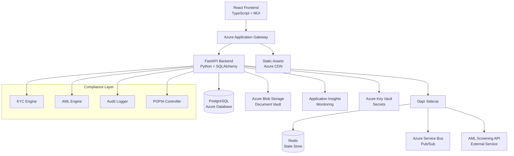
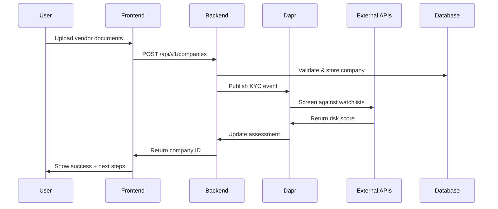
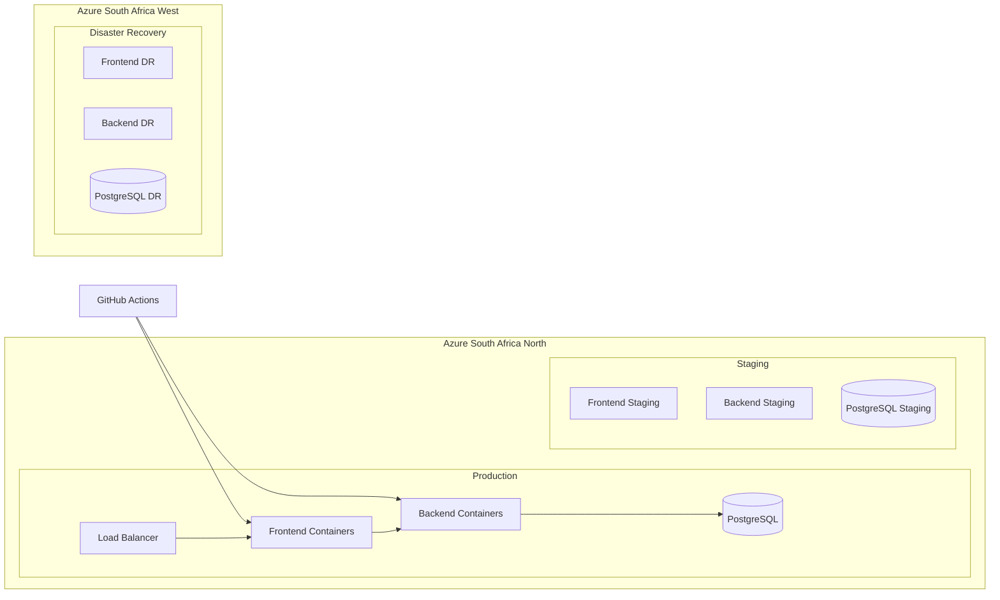

# ThirdPartyRiskPortal - Enterprise Architecture

## Overview

The ThirdPartyRiskPortal is a comprehensive enterprise-grade platform for managing third-party risk assessments, due diligence processes, and compliance workflows. Built with modern microservices architecture, it leverages Azure cloud services, Dapr for distributed application runtime, and React for a responsive user interface.

## Architecture Components

### 1. Frontend (React + TypeScript)
- **Framework**: React 18 with TypeScript
- **UI Library**: Material-UI (MUI) v5
- **State Management**: React Context API + TanStack Query
- **Form Handling**: React Hook Form with Yup validation
- **Routing**: React Router v6
- **HTTP Client**: Axios with interceptors

### 2. Backend (FastAPI + Python)
- **Framework**: FastAPI with async support
- **Database**: SQLAlchemy with PostgreSQL
- **Authentication**: OAuth2 with JWT tokens
- **Validation**: Pydantic models
- **Documentation**: Auto-generated OpenAPI/Swagger

### 3. Azure Integration
- **Storage**: Azure Blob Storage with SAS tokens
- **Monitoring**: Application Insights
- **Secrets**: Azure Key Vault
- **Identity**: Azure AD integration

### 4. Dapr Integration
- **Service Discovery**: Automatic service-to-service communication
- **State Management**: Redis for distributed state
- **Pub/Sub**: Event-driven architecture
- **Bindings**: Azure Storage, Azure Service Bus
- **Observability**: Distributed tracing and metrics

## Security Architecture

### Authentication & Authorization
- **OAuth2 Flow**: Standard OAuth2 implementation with JWT tokens
- **Role-Based Access Control (RBAC)**: Admin, Assessor, Approver, User roles
- **Token Management**: Secure token storage and refresh mechanisms
- **Session Management**: Stateless JWT-based sessions

### Data Security
- **Encryption**: TLS 1.3 for data in transit
- **Storage Security**: Azure Storage encryption at rest
- **SAS Tokens**: Time-limited, scoped access to Azure resources
- **Input Validation**: Comprehensive validation at API boundaries

### Network Security
- **HTTPS**: TLS encryption for all communications
- **CORS**: Configured for specific origins
- **Rate Limiting**: API rate limiting and throttling
- **Security Headers**: XSS protection, content security policy

## Data Flow Architecture

### File Upload Flow
1. **Client Request**: User selects file for upload
2. **Validation**: Backend validates file type and size
3. **SAS Token Generation**: Backend generates secure upload URL
4. **Direct Upload**: Client uploads directly to Azure Storage
5. **Confirmation**: Backend confirms upload and updates metadata
6. **Database Update**: Document record created in database

### Assessment Workflow
1. **Assessment Creation**: User creates new risk assessment
2. **Task Assignment**: System generates tasks based on assessment type
3. **Data Collection**: Users upload documents and complete questionnaires
4. **Risk Calculation**: Dapr orchestrates risk scoring across services
5. **Approval Process**: Multi-level approval workflow
6. **Reporting**: Automated report generation and distribution

## Database Design

### Core Entities
- **Companies**: Third-party vendor information
- **Assessments**: Risk assessment records
- **Tasks**: Workflow tasks and assignments
- **Documents**: File metadata and storage references
- **Users**: System users and roles
- **Audit Logs**: Complete audit trail

### Relationships
- Companies have multiple assessments and documents
- Assessments generate multiple tasks
- Users are assigned to tasks and assessments
- All actions are logged in audit trail

## API Design

### RESTful Endpoints
- **Companies**: `/api/v1/companies`
- **Assessments**: `/api/v1/assessments`
- **Tasks**: `/api/v1/tasks`
- **Documents**: `/api/v1/files`
- **Due Diligence**: `/api/v1/due-diligence`

### Response Format
```json
{
  "data": {},
  "meta": {
    "pagination": {},
    "filters": {}
  },
  "errors": []
}
```

## Monitoring & Observability

### Application Monitoring
- **Application Insights**: Performance monitoring and error tracking
- **Structured Logging**: JSON-formatted logs with correlation IDs
- **Health Checks**: Endpoint health monitoring
- **Metrics**: Custom business metrics and KPIs

### Distributed Tracing
- **Dapr Tracing**: Automatic request flow tracking
- **Zipkin Integration**: Trace visualization and analysis
- **Correlation IDs**: Request correlation across services

## Deployment Architecture

### Development Environment
- **Docker Compose**: Local development with all services
- **Hot Reload**: Development server with auto-reload
- **Database**: PostgreSQL with persistent volumes

### Production Environment
- **Azure Container Instances**: Scalable container deployment
- **Azure Database**: Managed PostgreSQL service
- **Azure Storage**: Managed blob storage
- **Azure Application Gateway**: Load balancing and SSL termination

## Performance Considerations

### Frontend Optimization
- **Code Splitting**: Lazy loading of components
- **Bundle Optimization**: Tree shaking and minification
- **Caching**: Static asset caching and service workers
- **CDN**: Content delivery network for global performance

### Backend Optimization
- **Database Indexing**: Optimized queries and indexes
- **Connection Pooling**: Database connection management
- **Caching**: Redis for frequently accessed data
- **Async Processing**: Background task processing

## Security Best Practices

### Code Security
- **Dependency Scanning**: Regular security updates
- **Code Analysis**: Static code analysis tools
- **Input Sanitization**: Comprehensive input validation
- **Error Handling**: Secure error messages

### Infrastructure Security
- **Network Segmentation**: Isolated network segments
- **Access Control**: Principle of least privilege
- **Monitoring**: Security event monitoring
- **Backup**: Regular data backups and recovery testing

## Compliance Features

### Audit Trail
- **Complete Logging**: All user actions logged
- **Data Retention**: Configurable retention policies
- **Access Logs**: User access and permission changes
- **Change Tracking**: Document version history

### Data Protection
- **GDPR Compliance**: Data privacy and protection
- **Data Classification**: Sensitive data identification
- **Encryption**: End-to-end data encryption
- **Access Controls**: Granular permission management

## Implementation Details

### Backend Code Organization
- **Structure**: `backend/app/` contains:
  - `models.py` (SQLAlchemy models)
  - `schemas.py` (Pydantic models for request/response)
  - `routers/` (endpoint modules: `auth.py`, `users.py`, `company.py`, `assessments.py`, `files.py`, etc.)
  - `database.py` (DB session, engine)
  - `security.py` (password hashing, JWT utilities)
  - `config.py` (environment settings via `.env`)
  - `main.py` (FastAPI app setup, CORS, router registration)
- **Migrations**: Alembic under `backend/alembic/`, migrated from SQLite to PostgreSQL; uses `alembic.ini` and environment scripts.
- **Auth**: OAuth2 JWT in `/api/v1/auth` with `/login` and `/me`; secure password hashing; role-based checks.
- **CORS**: Configured to allow the React frontend origin.
- **File Upload**: Azure Blob Storage with SAS tokens via `files.py` router; direct client upload flow.

### Frontend Code Organization
- **Project**: `frontend/src/`
  - `contexts/AuthContext.tsx` for token management and protected routes
  - `components/` for reusable UI elements (Layout, Nav, etc.)
  - `pages/` for views: Dashboard, Companies, Assessments, Documents, Login, Tasks
  - `services/api.ts` (Axios instance with interceptors)
  - `App.tsx` and `index.tsx` (routing and app bootstrap)
- **Libraries**:
  - React 18, TypeScript, MUI v5
  - React Router v6, React Hook Form, Yup
  - TanStack Query for data fetching
- **Build**: `.env` holds `REACT_APP_API_BASE_URL`; production build in `frontend/build` served by Nginx and Docker.

### Deployment & Environment
- **Local Dev**: Docker Compose (`docker-compose.yml`) spins up FastAPI, PostgreSQL, Redis, Dapr sidecar, Azurite emulator.
- **Production**: Azure Container Instances or Web App; Azure Database for PostgreSQL; Azure Blob Storage; Application Gateway for SSL.
- **Dapr**: Components in `dapr/components.yaml` for pub/sub (Service Bus), state store (Redis), bindings.

### Testing & CI/CD
- **Backend**: Unit tests with `pytest`, integration tests via TestClient; Alembic migration checks.
- **Frontend**: Jest + React Testing Library for unit tests; end-to-end tests can be added (Cypress).
- **CI/CD**: GitHub Actions pipeline for lint, test, build, and deploy to Azure.

---

## Future Enhancements

### Planned Features
- **AI/ML Integration**: Automated risk scoring
- **Advanced Analytics**: Business intelligence dashboards
- **Mobile App**: Native mobile application
- **API Gateway**: Azure API Management integration
- **Multi-tenancy**: SaaS platform capabilities

### Scalability Improvements
- **Microservices**: Service decomposition
- **Event Sourcing**: Event-driven architecture
- **CQRS**: Command Query Responsibility Segregation
- **Horizontal Scaling**: Auto-scaling capabilities

## 📊 Architecture Diagrams

### System Architecture


### Data Flow Architecture


### Deployment Architecture
